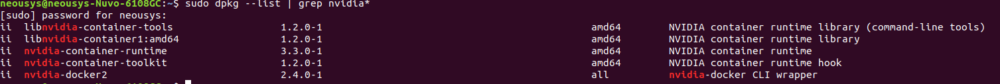
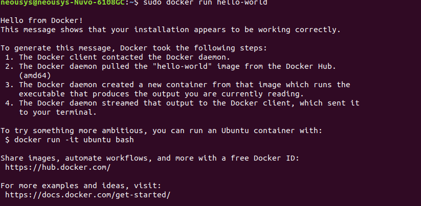
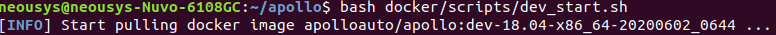

# 从零开始搭建 Apollo 自动驾驶系统（一）——Apollo 系统安装

> 万事开头难。

此部分主要分为 IPC 硬件系统安装和软件系统安装两大部分。

## 硬件系统安装

一般硬件系统在出厂时都会安装好，所以基本不用担心硬件的问题，除非极端状况下造成硬件损坏，这就需要及时联系客服维修了。

需要注意的几个部分：
- 要根据自己 IPC 的型号确定自己的 CAN 卡类型，涉及到后面测试时一些 WARNING 的处理，这个在官方文档中都有提到。
- 学习如何拆解 IPC。这一部分官方文档上有说明（具体旋什么螺丝、如何把盖板打开等），有时候希望自行确认 IPC 内部是否有硬件问题时可能需要用到这一知识。

## 软件系统安装

这一部分包括 Linux 系统的安装、硬件驱动的安装、相关软件的安装和 Apollo 系统的安装。

由于我们在拿到 IPC 时已经装好了 Linux 系统，且已经有了 Apollo-kernel，所以对于第一部分，唯一的提示就是**千万注意每次开机前，选取 Ubuntu 高级选项 -> 倒数第二项的 Apollo-kernel 来引导系统**。

### 硬件驱动的安装

按照官方文档，需要安装和测试网卡、GPU、CAN 卡三个硬件设备的驱动程序。

需要注意的几个部分：
- 使用 `sudo dpkg --list | grep nvidia*` 测试显卡驱动用户库时，可能无法看到明显的 `430.50` 字样。对此，我们给出我们的一个显示作为参考：
  
  
  
- 安装 CAN 卡驱动时，需要根据此前确认的 CAN 卡类型进行安装。如果安装的是 EmucCAN，那么在测试时可能需要准备一条**较为特殊的 CAN 线**以将 IPC 的两个 CAN 口相连接。

### 相关软件的安装

这一部分需要安装好 Docker 并测试它。如果正常运行的话，会出现下面的结果：

如果无法正常运行 Docker 的 hello-world 示例，出现类似于 `Cannot connect to the Docker daemon. Is the docker daemon running on this host?` 的错误，可以按照网上的说法重启 Docker 试试，或者干脆彻底删除 Docker，然后重新安装。

关于如何彻底删除 Docker 可以参考[这篇文章](https://tips.tutorialhorizon.com/2016/07/30/how-to-completely-uninstall-docker-from-ubuntu/)。

### Apollo 系统的安装

这是最困难的一个部分。

首先需要下载 Apollo 源代码。但这部分难以完成，因为代码文件非常大（大于 1.5 G）且源在国外，无论是使用 `git clone` 还是直接以 .zip 方式下载都非常容易因网络原因中途失败。

要解决这一问题有几种方法：
- 借一个比较靠谱的服务器，利用服务器下载。
- 使用码云的服务，将 Github 上的 Apollo 项目导入，再 clone 到本地。

需要注意的地方：
- 最好先切换到 r5.5.0 版本再下载，否则直接下载下来是 master 分支而不是 r5.5.0 版本分支。
- 直接下载下来的 .zip 压缩包不会有 .git 文件夹，这会导致无法进行分支的切换，也无法进行未来可能的更新。因此为了可持续发展考虑，**强烈建议使用 clone 的方式下载代码**。
- 如果 clone 下来的分支切换到 r5.5.0 版本有困难（如显示本地有文件冲突），那么可以先用 `git fetch --all` 和 `git reset --hard origin/master` 强制和远程仓库的 master 分支同步，再使用 `git pull origin r5.5.0` 和 checkout 指令切换分支。

然后需要设置编译环境。这一步我们没有用到 `images_r5.5.0` 目录，但也能正常做。

最后开始编译。编译先会花很长时间下载镜像文件，然后再开始编译。需要注意的地方：
- 拉取镜像需要非常长的时间，所有的镜像文件大约有 7 个多 G。因此可以先去网上查找并设置成国内的镜像源，可以稍微加快一些速度。但这一步需要**慎重处理被修改配置文件的读写权限，处理不当可能导致更多错误**。
- 编译源码需要很长的时间（大约 35 分钟）。编译之前可能无法正常启动 Docker，如报出 `unable to find user root: no matching entries in passwd file` 错误，这时比较有效的解决方法是直接把 Docker 删了重装。

在拉取镜像时，界面大致如下所示。

下载并运行 DreamView 的回放数据包是选做的，可以做也可以不做，对于后面的过程没有太多影响。但做的时候需要注意一点：下载数据包的时候，运行 python 程序默认是把数据包下载到 python 文件所在的目录下，所以在回放数据包时一定要指定好目录，在官方的示例中是没有指定目录的，会导致报错。

## 小结

这一部分最困难的地方在于各种下载和运行，我们在完成这一部分时花费了将近一周的时间。因此强烈建议**在一个良好的网络环境下完成各种下载过程**。

同时一定要注意 Apollo 系统的版本是否正确，以及 Docker 是否正确地安装了，**一旦弄错，不仅镜像等要重新下载，编译还要重新进行，后果非常严重！**