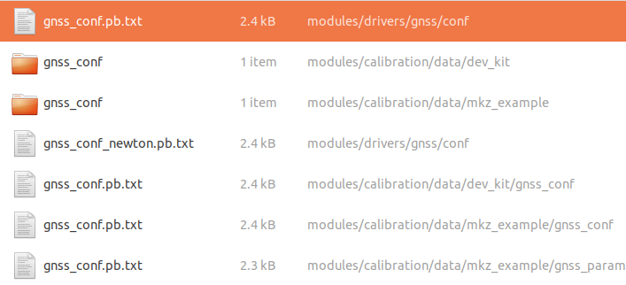
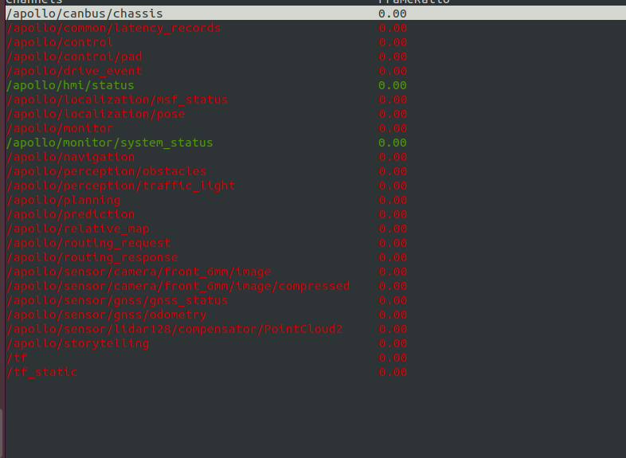
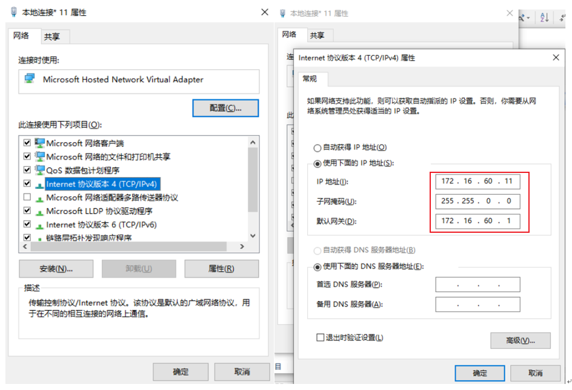
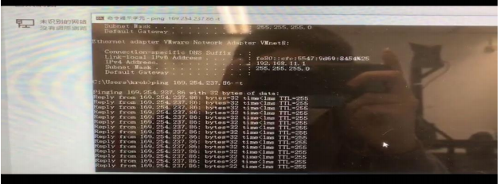

# 从零开始搭建 Apollo 自动驾驶系统（三）——定位模块配置

此部分分为导航设备配置、系统文件配置、定位文件配置三个模块。

最后一个模块相对简单，此处我们不叙述。而前两个模块中，较复杂的在于第二部分，涉及到很多玄学问题。

## 导航设备配置

首先，进行导航设备配置。基本按照官方文档的代码示例就可以完成，只是 copy-paste 的工作，**最后一定记得输入保存语句然后重启**。这里需要稍作解释的是网口配置里面的各种 IP。

每个路由器都有一个域名（在路由器上写着），比如是 `192.168.0.1`。用网线连上 IPC 之后会自动给 IPC 一个 IP，一般是 `192.168.0.2`。然后再用网线连上 M2 的网口，这时我们可以给 M2 指定 IP，比如 `192.168.0.123`，**注意此 IP 的最后一个数字不能和路由器一样**。

设置网关时可以直接使用路由器的 IP，子网掩码一般默认是 `255.255.255.0`，也可以登录路由器的局域网进行查看。设置完成后，我们可以检测一下 M2 的 IP 是否真的配置好了，可以在终端中对 M2 的 IP 地址 ping 一下，如 `ping 192.168.0.123`，检查是不是会有正常的反馈。

## 系统文件配置

下面就要进行最最搞心态的系统文件配置了。

首先要有一个千寻知寸账号，好像还不便宜。有了账号之后，只需要记住自己的差分账号、差分密码即可，因为 RTK 基站的 IP 地址、端口、挂载点这些参数，全国人民都是一样的，所以直接抄官方文档就可以。

然后需要修改配置文件，相关文件可以直接在 apollo 文件夹下搜索到，一般来说会有 2 个或者 4 个同名文件，修改前两个即可。

修改时可以参考官方文档最后常见问题的 Part b，顺便把 `+zone` 选项也修改了。

修改好了之后你就要进入到“检查 GPS 信号”这一环节了（在这一环节我们卡了两天之久）。按照一些官方人士的说法，为了避免玄学问题，**在执行 `cyber_monitor` 之前最好先将终端最大化**。正常情况下在执行 `cyber_monitor` 之后会看到如下界面。

顺带一提，这里可以通过<kbd>➡</kbd>进入某个条目，通过<kbd>⬅</kbd>退出某个条目。这一操作细节在官方文档最后也有提及。

这里可能会出现几个问题：
- 界面中没有 `/apollo/sensor/gnss/best_pose` 条目。可以尝试在启动 `bootstrap.sh` 后，在 DreamView 的车型里面选择 `Dev-kit`，然后再启动 `gps.sh` 和 `localization.sh` 以解决。
- 界面中可能没有 `/apollo/sensor/gnss/imu` 这一条目，这代表 M2 收不到数据，那就可能是因为 M2 该升级固件了。可以在 cutecom 里面执行 `$cmd,get,sysinfo*ff`，它会输出目前 M2 的版本信息，需要询问客服看看当前是不是最新版。这时有两种情况：
  - 如果不是最新版，那就得联系客服进行固件版本的更新。
  - 如果是最新版，那就得看看 M2 是不是内部损坏了（几率很小），详细步骤见文末。

一旦你看到了文中所说的 `NARROW_INT`，就说明 M2 已经差分上了，也就是说 GPS 已经连上了。一旦 `/apollo/sensor/gnss/imu` 条目里有了数据更新，那就说明 M2 收到了 GPS 传过来的数据，你的 GPS 模块配置成功了。

如果 `/apollo/sensor/gnss/imu` 没有数据，那么可能需要重新启动 Apollo 系统，或者检查 M2 的固件是否达到最新。还有一种可能是 `gnss_conf.pb.txt` 突然自行改变了，原来设置的帐号密码等信息消失了。这时再设置一次即可。

最后就是定位模块的配置，这里只需要根据官方文档改一下相关的参数。然后在 `/apollo/localization/pose` 条目下观察有没有数据更新。一般在出现 `NARROW_INT` 之后，需要等上两三分钟才能看到定位信息，此处需要耐心。

## 附录：关于 M2 不差分的问题总结

截至 2020.7.17，M2 的最新版本为 V2.8，如果遇到不差分，首先查看程序是不是最新版本，如果不是升级到最新版本再测试。

查看 M2 程序版本方法，通过升级口或者 USB 口，发送以下命令：`$cmd,get,sysinfo*ff`。

程序没问题后，查看 M2 硬件设备是否正常。方法如下（在 windows 下）：
1. 调出 cmd，输入 `ipconfig`，看到自己电脑的 IPv4 地址，如下所示。
   
   

2. 打开电脑以太网的 IPv4 的地址属性，不自动获得 IP 地址，并手动输入 IP 地址、子网掩码、默认网关等信息。如下所示。

   

3. 设置 M2 的 `localip` 和 `localgate`（网关），M2 的 `localip` 与电脑 IP 设置不一样即可。M2 的 `localgate` 和电脑相同。 
4. 用网线连接 M2 和电脑，在 cmd 中输入：`ping localip –t`，其中 `localip` 是之前设置的 M2 的 `localip`。ping 通 M2 后，如果看到连续输出，证明 M2 的程序以及硬件是好的。如果 ping 的时候，不输出，或者超时，证明 M2 硬件有损坏，需要返厂维修。ping 通的结果如下所示。

   

在 M2 硬件以及设置都没问题后，再不差分的情况，需要检查千寻的账号是否过期、4G 路由器、以及测试环境是否能定位。

关于千寻账号不断 log in 和 log out 的问题，可能有几种原因：
1. 没定位。
2. 用户处于千寻没有覆盖或者临界地区。
3. 网络拥堵。
4. 同一千寻账号，多台设备使用。