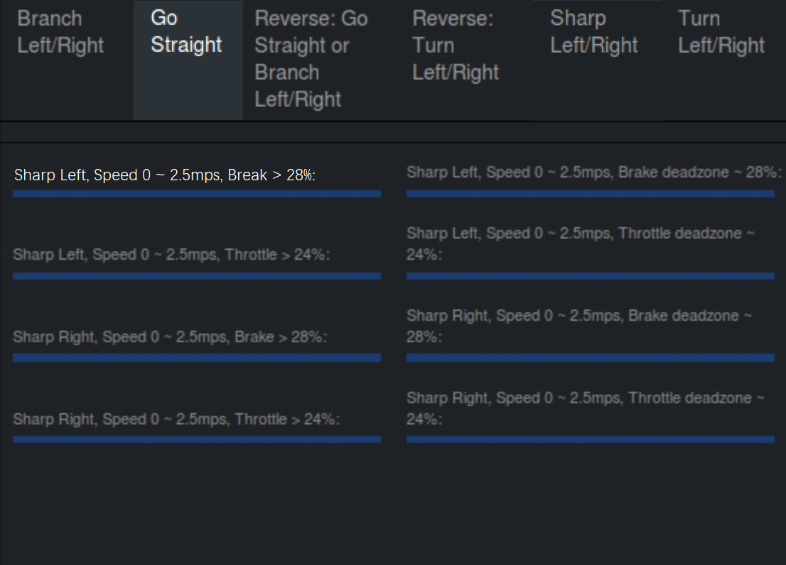

# 从零开始搭建 Apollo 自动驾驶系统（四）——车辆动力学云标定

此部分可大致分为前期准备、数据采集、任务提交三个模块。

## 前期准备

前期准备主要需要斥巨资注册一个百度智能云的账号，和商务部门进行联系然后开通服务。由于我们在使用时正好赶上服务平台崩溃了，所以并没有成功开通，但是这并不影响车辆的正常标定。

对于文档中想要修改的参数，我们可以直接使用默认值，默认的采集数量是 4000 帧，大约采集时长为 40-60 分钟。如果怕时间太长可以考虑适当缩小一下这个数值。

## 数据采集

数据采集时，需要我们有足够的耐心，分好几种情况进行采集，可以分多次采集，系统会自动保存。

在进行采集之前，**记得打开 DreamView 的 `Recorder` 开关，否则是不会记录数据的**。

在进行采集时，可以按照官方文档提到的 8 种情况有针对性的进行采集，在某种情况被成功采集到时，这一情况对应的进度条上的名称会变亮，看上去大致如下图所示。

正如官方文档所说，采集后的数据无论是否上传，都会自动保存在本地并生效。

## 任务提交

任务提交时**需要注意文件的命名和提交格式**，这一部分可以参考官方文档。

提交给云平台后，平台应该会给出反馈，告知此次标定的数据是否有效，如果无效，需要重新进行标定。

正如前文说的，我们当时正赶上平台维修，无法正常的上传文件，所以也就不知道自己标定的结果是否正确，但是**是否做任务提交并不影响最终循迹任务的完成，只是最后循迹结果可能会存在一定的误差**，当然这都是后话了。

如果感兴趣，可以自己尝试修改一下文件中的默认参数，试试不同的参数设置会带来什么结果上的改变，在此就不一一叙述了。