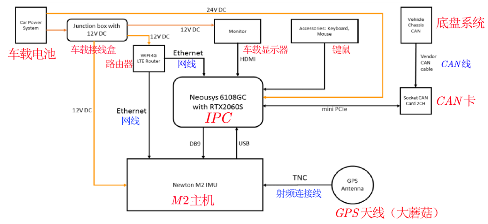

# 从零开始搭建 Apollo 自动驾驶系统（二）——车辆集成

此部分完成的是安装 IPC（工控机）和 GPS 导航设备等硬件，包括了机械层面的安装校准、线材的连接和固定参数的测量。

首先，我们先一起来理解一下官方文档中给出的整车设备集成后的硬件连接图：

整车硬件系统基本可以分为四个大类：计算中心（IPC）、传感器、底盘、路由器。
1. 底盘：是酷黑自己开发的纯电线控底盘，遥控器也是用来直接控制底盘的，不加 IPC 也可以通过遥控器实现对底盘的运动学控制，具体操作方法详见[车辆上手文件](Getting_Start.pdf)。
2. 传感器：包括 GPS 天线、激光雷达、工业相机、毫米波雷达（在车头）。**从功能上讲，GPS 是让车子知道自己在哪，其他的是让车子知道自己周围有啥**。另外，最最重要的一个设备就是 Newton M2 IMU 了，它类似于一个整车的感知中心，后面会有详细介绍。
3. 计算中心（IPC）：从连接图的位置就可以看出来，IPC 是整个系统的核心，它承担着数据储存、数据处理和指挥的功能。底盘系统通过 CAN 线和 IPC 相连，一方面可以向上位机反馈底盘的实时数据，另一方面用来接收上位机的指令。IMU 通过 USB 接口向 IPC 反馈数据，同时 IPC 通过升级口来实现对 IMU 的端口配置。
4. 路由器：功能很直观，就是有网。有了网才能进行 GPS 定位。

下面简单介绍一下 IMU（不涉及具体技术细节），对于初学者来说，了解一下这一设备的工作原理还是很有必要的。

**IMU（Inertial measurement unit，惯性测量单元）**，是测量物体三轴姿态角及加速度的装置。一般 IMU 包括三轴陀螺仪及三轴加速度计，某些 9 轴 IMU 还包括三轴磁力计。一般的，一个 IMU 包含了三个单轴的加速度计和三个单轴的陀螺，加速度计检测物体在载体坐标系统独立三轴的加速度信号，而陀螺检测载体相对于导航坐标系的角速度信号，测量物体在三维空间中的角速度和加速度，并以此解算出物体的姿态。此设备大多用在需要进行运动控制的设备，如汽车和机器人上，也被用在需要用姿态进行精密位移推算的场合，如潜艇、飞机、导弹和航天器的惯性导航设备等。

对于各个设备的安装和接线，在官方文档中给出了简单的说明和指导，基本已经够用了，下面说一下根据经验总结出的 IMU 比较好的安装方式。

以酷黑小车为例，它采用了 GPS 天线车头和车尾前后安装方式，所以： 
- M2 主机安装：**主机尽量水平的安装在车上，主机的 Y 轴方向朝向车头，且 Y 轴本身尽量与车的中轴线重合或者平行**。 
- GPS 天线安装：车头用磁底座吸附在车顶安装一个天线，用天线馈线连接 M2 的 SEC 天线孔；车尾用磁底座吸附在车顶安装一个天线，用天线馈线连接 M2 的 PRI 天线孔，并且两个天线的连线尽量与车的中轴线重合或者平行。 

总之，原则就是主机的 Y 轴、车的中轴线、两个天线的连线三者尽量重合或平行，所有设备和车身一定都要**固连，固连，固连**。 比如一旦 IMU 和车身产生了相对运动，不仅之前的测量数据都会失效，还有可能让小车在自动驾驶时疯掉。

这一步可以先不连接激光雷达、摄像头、毫米波雷达，因为循迹时用不到这些设备，在后面进一步开发时才会使用。